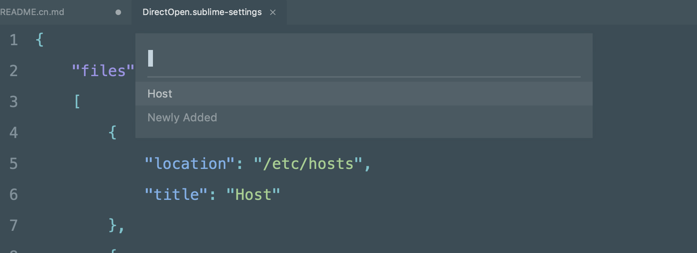

中文文档请见 [这里][readmecn]

## Installation

There are two ways to install, the first and recommended way it via `Package Control`:

1. Make sure you have `Package Control` installed, see <<https://packagecontrol.io/installation>
2. Search for `Direct Open` using `Package Control` and install

Another way is to clone source from github:

1. Enter you sublime text's package folder
2. Run `git clone https://github.com/UniFreak/SublimeDirectOpen.git`

## Configuration & Usage

There is already a configured `Host` entry in the setting file, you can add your own file entries according to `Host` configuration. The file name is in `title` config and file path is in `location`, like this:

```json
{
    "files":
    [
        {
            "title" : "Host",
            "location" : "/etc/hosts"
        },
    ]
}
```

After configuration, you can then bring up the file selection pop-up by hitting `ctrl+shift+o` (Windows) or `super+shift+o` (Mac) and select one file for editing. like this:



## Thanks

Many thanks to the [SublimeHostsEdit][hostsEdit]'s author, it inspired me to create this plugins. Actually this plugins is simply a extended version of `SublimeHostsEdit`, and I refered to it a lot when begining my path of learning python and sublime plugin development.

## TODO

[hostsEdit]: https://github.com/martinssipenko/SublimeHostsEdit
[readmecn]: https://github.com/UniFreak/SublimeDirectOpen/blob/master/README.cn.md
